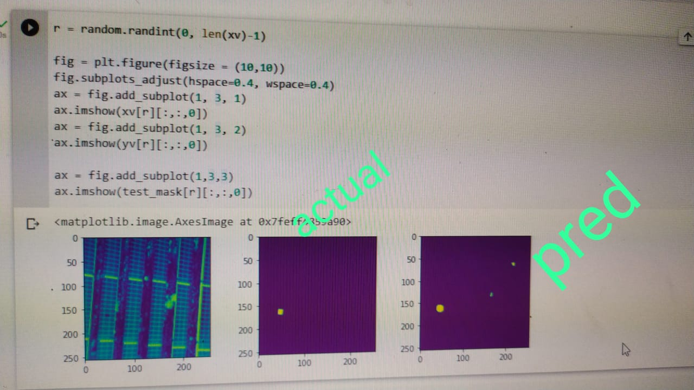

# DL-for-Thermal-Images
I'm trying to convert this paper from theoretical into coding to expand knowledge to others
## this paper is called Automatic Faults Detection of Photovoltaic Farms: solAIr, a Deep Learning-Based System for Thermal Images 
you can get it from [MDPI](https://www.mdpi.com/1996-1073/13/24/6496)

## the dataset is private , if u want it , send email to them 

### first thing i made, i tried to visulaize the images and play with them by merge image and its mask together and make some Statistics
### the images is 4 channels , so i convert them into 3n channels
### for classification part , i used efficientNet model
### for segmentation , i used ResNet (but the researhers used 3 models together , so i will try in this part asap in the next days)

